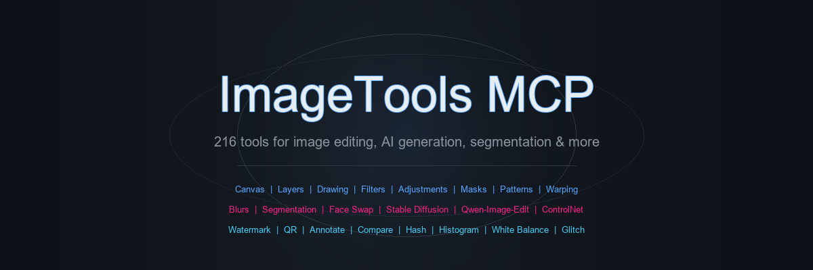
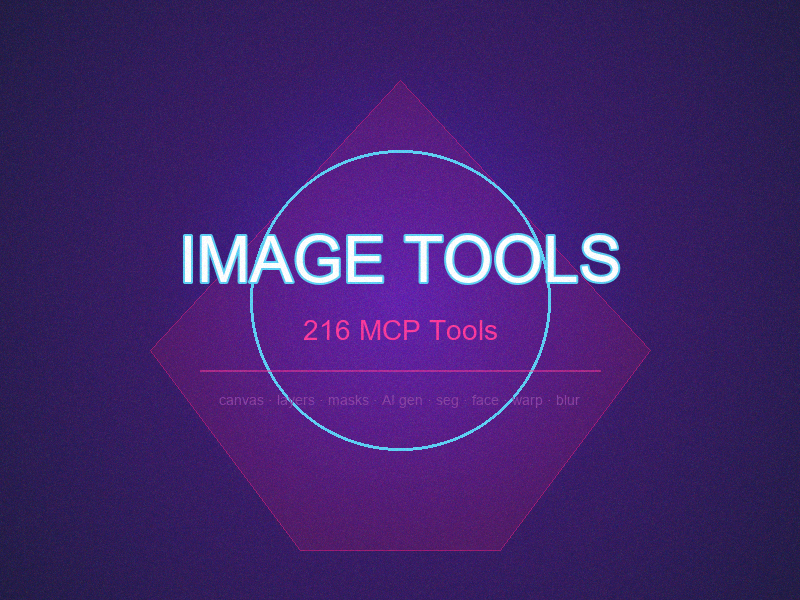
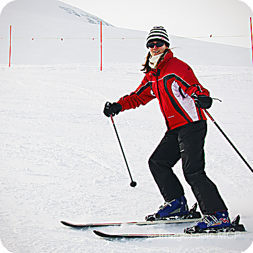
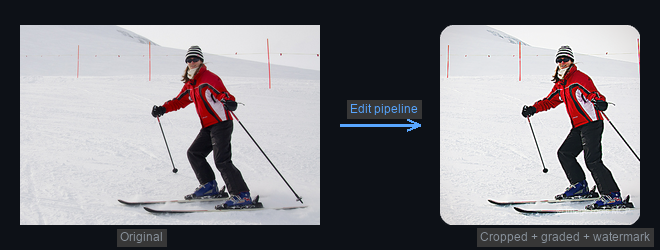
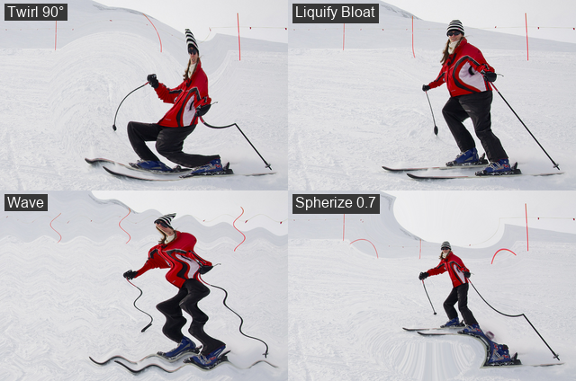
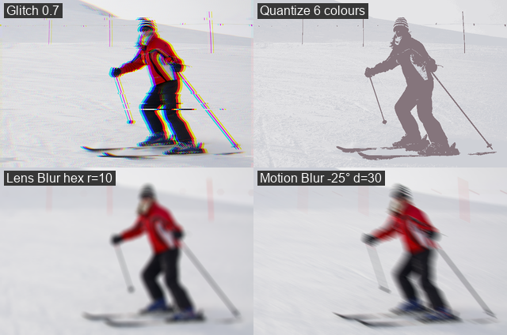
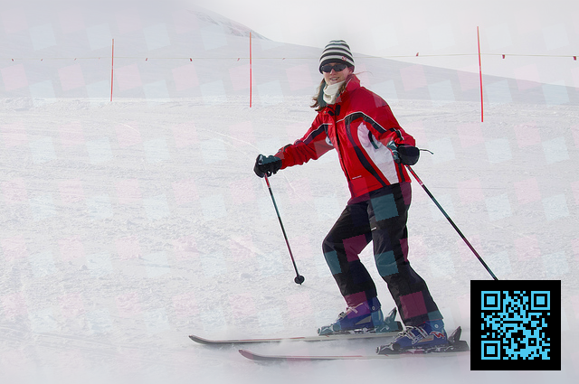

<p align="center">
  
</p>

<p align="center">
  <strong>A 216-tool MCP server for image editing, AI generation, segmentation, face swap, and more.</strong><br>
  Built with <a href="https://modelcontextprotocol.io">FastMCP</a> for Claude Code / Claude Desktop / any MCP client.
</p>

<p align="center">
  
  
  
  
</p>

---

## What is this?

ImageTools MCP is a **Model Context Protocol server** that gives AI assistants (Claude, etc.) full image-editing capabilities — from basic drawing to Photoshop-grade adjustments, AI-powered generation, face swapping, and everything in between. All 216 tools work over an in-memory canvas with a Photoshop-style layer stack, undo/redo history, and non-destructive editing.

### Showcase

<table>
<tr>
<td></td>
<td></td>
</tr>
<tr>
<td><em>Drawing, gradients, layers, blend modes, text, vignette, noise</em></td>
<td><em>Smart crop, curves, white balance, unsharp mask, watermark, rounded corners</em></td>
</tr>
</table>



<table>
<tr>
<td></td>
<td></td>
</tr>
<tr>
<td><em>Twirl, Liquify Bloat, Wave, Spherize</em></td>
<td><em>Glitch, Colour Quantize, Lens Blur (hex), Motion Blur</em></td>
</tr>
</table>


<br><em>Pattern fill (rotated, screen blend) + tilt-shift depth-of-field + QR code overlay</em>

> Every image above was created entirely through this MCP server — no external tools.

---

## Features

### Core Image Editing
- **Canvas + Layers** — Photoshop-style layer stack with opacity, blend modes (14 modes), masks, offsets, undo/redo (32-deep)
- **Drawing** — pixel, line, rectangle, ellipse, polygon, arc, text (TTF), brush, eraser, flood fill, colour picker
- **Transforms** — crop, resize, rotate, flip, copy/paste regions, auto-crop-to-content, smart-crop-to-aspect, letterbox
- **Filters & Adjustments** — hue/saturation, levels, curves, colour balance, threshold, vibrance, channel mixer, gradient map, auto levels/contrast, equalize, unsharp mask, high-pass, white balance
- **Gradients** — linear, radial, angular, reflected, diamond with multi-stop colours
- **Channels** — extract/merge/split R/G/B/A/L channels
- **Painting Brushes** — clone stamp, dodge, burn, blur, sharpen (stroke-based)
- **Layer Effects** — drop shadow, outer glow, layer stroke

### Patterns (Photoshop-style)
- **Define/load/manage** pattern library (in-process registry)
- **Fill Pattern** — tile across canvas with scale/rotation/offset/blend
- **Pattern Stamp** — paint with pattern as a soft brush
- **Pattern Overlay** — add as a blended layer
- **Make Seamless** — wrap-offset + edge cross-fade for tileable textures

### Warping & Distortion
- **Perspective Warp** — 4-corner quad transform
- **Mesh Warp** — thin-plate spline with N control points
- **Liquify** — push, twirl CW/CCW, pucker, bloat brushes
- **Distort Filters** — spherize, pinch, twirl, wave, ripple, polar↔rect
- **Displacement Map** — grayscale or R/G channel-driven displacement

### Blur Effects
- **Motion Blur** — directional streak at any angle
- **Radial Blur** — spin (rotational) or zoom (radial out)
- **Lens Blur** — disc or hex-aperture bokeh
- **Tilt-Shift** — fake-miniature depth-of-field
- **Box Blur** — fast mean kernel

### Segmentation (5 models)
- **SAM 2** — point/box/everything prompts (Meta's Segment Anything 2.1)
- **SAM 1** — ViT-L/H/B (best COCO box prompts, 0.78 median IoU)
- **YOLOv8L-seg** — 80-class instance segmentation (20ms inference)
- **BiRefNet** — one-shot background removal
- **CLIPSeg** — text-prompted segmentation ("the rusty bicycle")
- **Mask Overlay/Preview** — visualise masks with coloured overlays + bbox + labels

### Face Swap & Restore
- **InsightFace** `buffalo_l` detector + `inswapper_128.onnx` face swap
- **GFPGAN** v1.4 face restoration/enhancement
- Detect → swap → restore in one pipeline. — slim by design.

### AI Generation (optional, GPU recommended)
- **Stable Diffusion** — txt2img, img2img, inpaint (SD1.5/SDXL/SD3/FLUX)
- **Qwen-Image-Edit** — instruction-driven image editing with Q4 GGUF quantization + Lightning 4-step LoRA
- **ControlNet** — structural conditioning for both SD and Qwen (canny/depth/pose + preprocessors)
- **LoRA Stacking** — load multiple LoRAs with adjustable weights
- **GGUF Support** — quantized transformers for consumer GPUs (24 GB VRAM)

### Utilities
- **Watermark** — text or image, 9-position placement
- **QR Code** — generation with custom colours and error correction
- **Perceptual Hash** — pHash/aHash/dHash for duplicate detection
- **Image Compare** — MSE/RMSE/PSNR/SSIM/diff% + visual diff overlay
- **Histogram** — per-channel histogram data
- **Colour Replace** — swap colour bands with tolerance + feather
- **Rounded Corners** — alpha-masked corner rounding
- **White Balance** — gray world / white patch / simplest colour balance
- **Annotate** — batch draw rects, arrows, circles, labels
- **Glitch Effect** — RGB channel shift + row displacement
- **Pixelate** — mosaic with bbox or mask region support
- **Palette Extract** — k-means dominant colour extraction
- **Colour Quantize** — reduce to N colours with dithering

### Format Support

| Format | Read | Write | Backend |
|---|---|---|---|
| PNG/JPEG/BMP/GIF/WebP/TIFF/ICO | ✅ | ✅ | Pillow |
| PCX/TGA/PPM/DDS | ✅ | ✅ | Pillow |
| HEIC/HEIF/AVIF | ✅ | ✅ | pillow-heif |
| SVG | ✅ | — | cairosvg (rasterized) |
| Camera RAW (CR2/NEF/ARW/DNG) | ✅ | — | rawpy (`[raw]` extra) |
| PSD (layered) | ✅ | ✅ | psd-tools (layers + blend modes preserved) |
| PDF | ✅ | ✅ | Pillow + pdf2image |
| Animated GIF/PNG | ✅ | ✅ | extract_frames / build_animation |
| ICO (multi-size) | ✅ | ✅ | build_ico / split_ico |

---

## Install

### Quick Start (CPU-only, core tools)

```bash
git clone https://github.com/naab007/ImageTools_MCP.git
cd ImageTools_MCP
python -m venv .venv
.venv\Scripts\activate    # Windows
pip install -e .
```

### Full Install (GPU + all AI features)

```bash
# 1. CUDA torch (required for AI tools)
pip install --index-url https://download.pytorch.org/whl/cu121 \
    "torch==2.5.1+cu121" "torchvision==0.20.1+cu121" --no-deps

# 2. All extras
pip install -e ".[seg,sam,qwen,sd,yolo,gguf,face]"

# 3. Pin known-good versions (critical for Qwen GGUF)
pip install --force-reinstall "safetensors<0.8" "transformers==4.57.1"

# 4. Additional deps
pip install bitsandbytes gguf peft kornia ultralytics opencv-python \
    polars ultralytics-thop qrcode scipy onnxruntime-gpu gfpgan insightface==0.7.3
```

### Register with Claude Code

```bash
claude mcp add -s user image-tools -- \
    /path/to/ImageTools_MCP/.venv/Scripts/python \
    /path/to/ImageTools_MCP/run_server.py
```

Restart Claude Code. The server registers 216 tools as `mcp__image-tools__*`.

---

## Optional Extras

| Extra | What it adds | Size |
|---|---|---|
| `[seg]` | SAM 1, BiRefNet, CLIPSeg, YOLO segmentation, OpenCV | ~2 GB |
| `[sam]` | Segment Anything 2.1 | ~1 GB |
| `[sd]` | Stable Diffusion txt2img/img2img/inpaint + ControlNet | ~4 GB |
| `[qwen]` | Qwen-Image-Edit + ControlNet + GGUF + bnb 4-bit | ~4 GB |
| `[yolo]` | YOLOv8 instance segmentation | ~200 MB |
| `[gguf]` | GGUF quantized model loading | ~100 MB |
| `[face]` | Face swap (InsightFace + inswapper_128 + GFPGAN) | ~1.2 GB |
| `[raw]` | Camera RAW format support | ~50 MB |

---

## Tool Categories (216 total)

| Category | Count | Highlights |
|---|---|---|
| Canvas lifecycle | 11 | new, open, save, close, duplicate, undo/redo, preview |
| Drawing | 12 | pixel, line, rect, ellipse, polygon, arc, text, brush, eraser, flood fill, pick colour |
| Transforms | 9 | crop, resize, rotate, flip, copy/paste, auto-crop, smart-crop, letterbox, pixelate |
| Filters & Adjustments | 18 | hue/sat, levels, curves, colour balance, threshold, vibrance, channel mixer, gradient map, unsharp mask, high-pass, vignette, noise, bilateral, white balance |
| Gradients | 1 | linear/radial/angular/reflected/diamond with multi-stop |
| Layers | 20 | add/remove/duplicate/rename/reorder, visibility, opacity, blend mode (14), offset, masks, merge, flatten |
| Layer effects | 3 | drop shadow, outer glow, stroke |
| Channels | 3 | extract, merge, split to layers |
| Painting brushes | 5 | clone stamp, dodge, burn, blur, sharpen |
| Patterns | 8 | define, fill, stamp, overlay, make seamless, library management |
| Warping / distort | 5 | perspective, mesh (TPS), liquify, distort filters (7 modes), displacement map |
| Blur effects | 5 | motion, radial (spin/zoom), lens (disc/hex), tilt-shift, box |
| Segmentation | 41 | SAM 2, SAM 1, YOLO, BiRefNet, CLIPSeg + mask overlay/preview |
| SD generation | 10 | status/load/unload, txt2img, img2img, inpaint, ControlNet |
| Qwen-Image-Edit | 15 | status/load/unload, edit, LoRA stacking, ControlNet generate/inpaint |
| Face swap | 7 | detect, transfer, restore, lifecycle |
| Format conversion | 16 | convert, batch, resize, thumbnail, crop, rotate, flip, grayscale, mode, metadata, animation, ICO, PDF |
| Utilities | 13 | watermark, QR, perceptual hash, compare/diff, histogram, colour replace, rounded corners, annotate, glitch |
| Preprocessors | 2 | canny edges, depth-from-grayscale |
| GGUF helper | 1 | download quantized models from HuggingFace |

---

## Qwen-Image-Edit GGUF Workflow

Run Qwen-Image-Edit-2511 at Q4 quantization on a consumer GPU (24 GB VRAM):

```
qwen_load(model="Qwen/Qwen-Image-Edit-2511",
          gguf_path="path/to/qwen-image-edit-2511-Q4_K_M.gguf")

qwen_load_lora(name="lightning4",
               source="lightx2v/Qwen-Image-Edit-2511-Lightning",
               weight_name="Qwen-Image-Edit-2511-Lightning-4steps-V1.0-bf16.safetensors")

qwen_edit_image(canvas_id="photo",
                prompt="add a colorful sunset in the background",
                steps=4, true_cfg_scale=1.0)
```

**Pinned dependency matrix** (critical — newer versions break on Windows):
- `transformers==4.57.1` (5.x segfaults loading checkpoint shards)
- `safetensors<0.8` (0.8rc0 access-violates in `torch.storage`)
- `diffusers==0.38.0` (ships QwenImageEditPlusPipeline + GGUF support)
- `torch==2.5.1+cu121` (newer CPU-only torch breaks CUDA inference)
- `bitsandbytes>=0.43` (4-bit text encoder to fit in 24 GB VRAM)

---

## Architecture

```
run_server.py              # Entry point — prewarms AI imports in background
server/
  image_tools_server.py    # @mcp.tool() surface — 216 tools
  canvas.py                # In-memory canvas store + layer stack
  layers.py                # Layer compositing (14 blend modes)
  drawing.py               # Pixel-level drawing primitives
  transforms.py            # Crop, resize, rotate, flip, auto-crop, pixelate
  adjustments.py           # Hue/sat, levels, curves, unsharp, vignette, noise...
  gradients.py             # Multi-stop gradient fills
  channels.py              # Channel split/merge
  painting.py              # Clone stamp, dodge/burn/blur/sharpen brushes
  layer_effects.py         # Drop shadow, glow, stroke
  mask_ops.py              # Feather, expand, contract, refine, overlay, magic wand, blend
  patterns.py              # Pattern define/fill/stamp/overlay/make-seamless
  warp.py                  # Perspective, mesh (TPS), liquify, distort, displace
  blurs.py                 # Motion, radial, lens, tilt-shift, box blur
  palette.py               # Colour extraction + quantization
  utilities.py             # Watermark, QR, hash, compare, histogram, annotate, glitch...
  preprocessors.py         # Canny edges, depth-from-grayscale
  face_swap.py             # InsightFace + inswapper_128 + GFPGAN
  qwen.py                  # Qwen-Image-Edit + GGUF + LoRA + ControlNet
  sd.py                    # Stable Diffusion + ControlNet
  sam.py / sam1.py         # SAM 2 / SAM 1
  yolo_seg.py              # YOLOv8 segmentation
  birefnet.py / clipseg.py # Background removal / text-prompted seg
  gguf_io.py               # GGUF detection + download + quantization config
  io_formats.py            # Format loading/saving
  conversions.py           # Batch convert, animation, ICO, PDF
  stateless.py             # Stateless image ops dispatcher
  psd_io.py                # PSD layered read/write
  colors.py                # CSS/hex/tuple colour parser
```

---

## Colour Format

Colour args accept:
- CSS hex: `"#ff8800"` or `"#ff880080"` (with alpha)
- Named: `"red"`, `"transparent"`, `"none"`, `"clear"`
- Tuple: `[r, g, b]` or `[r, g, b, a]` (0-255)

---

## Notes

- All drawing/transform tools snapshot before mutating — every step is undoable (32-deep)
- The server uses a **two-phase prewarm**: lightweight imports (torch/transformers/diffusers) on the main thread, heavy pipeline classes in a background thread — so MCP `initialize` responds in ~5s even though the full AI stack takes ~60s
- AI model lifecycle follows a consistent pattern: `*_status` / `*_load` / `*_unload` / `*_set_idle_timeout` with a 1-hour idle sweeper that auto-frees GPU memory
- GGUF quantized models use diffusers' built-in loader — no ComfyUI-GGUF node needed (the tensor naming already matches diffusers conventions)

---

## License

MIT

---

<p align="center">
  Made with Claude Code + ImageTools MCP
</p>
